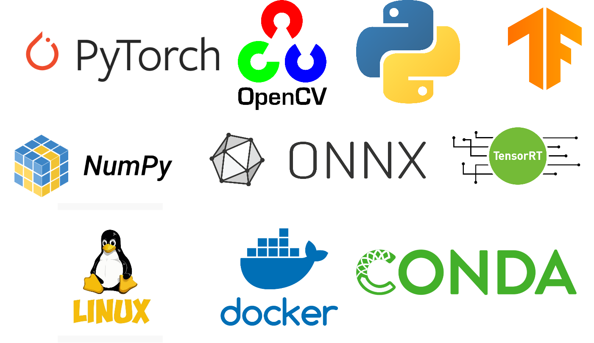

# learn_computer_vision
An organized collection of tutorials and projects created for aspriring computer vision students.  

## Getting started 

To start learning computer vision, you should start by installing: 
- Ubuntu (preferable 18 or over)
- Anaconda (for virtual environment)
- For computers with compatible NVIDIA GPU: Graphics cards drivers, CUDA and CUDNN.

## Table of contents 
- [PyTorch Tutorials](#PyTorch_Tutorials)
- [Assignments](#Assignments )

## PyTorch_Tutorials
### Basics
* [Tensor Basics](https://github.com/GivralNguyen/learn_computer_vision/blob/main/pytorch/basics/1_tensor_basics/pytorch_tensor.py)
* [Feedforward Neural Net](https://github.com/GivralNguyen/learn_computer_vision/blob/main/pytorch/basics/2_feedforward_nn/simple_fully_nn.py)
* [Convolutional Neural Net](https://github.com/GivralNguyen/learn_computer_vision/blob/main/pytorch/basics/3_covolutional_nn/pytorch_simple_cnn.py)
* [Weight Load/Save](https://github.com/GivralNguyen/learn_computer_vision/blob/main/pytorch/basics/4_save_load_weight/pytorch_loadsave.py)
* [Custom dataset](https://github.com/GivralNguyen/learn_computer_vision/tree/main/pytorch/basics/5_custom_dataset)
* [Finetune / Transfer learning](https://github.com/GivralNguyen/learn_computer_vision/blob/main/pytorch/basics/6_transfer_learning/pretrain_finetune.py)
* [Augmentation using torchvision](https://github.com/GivralNguyen/learn_computer_vision/blob/main/pytorch/basics/7_torchvision_agumentation/torchvision_aug.py)
* [Albumentation](https://github.com/GivralNguyen/learn_computer_vision/tree/main/pytorch/basics/8_albumentations_tutorial)
* [Tensorboard](https://github.com/GivralNguyen/learn_computer_vision/blob/main/pytorch/basics/9_tensorboard/pytorch_tensorboard.py)
### Architecture
* [DenseNet](https://github.com/GivralNguyen/learn_computer_vision/blob/main/pytorch/classification/models/densenet_classifier.py) 
* [DLA](https://github.com/GivralNguyen/learn_computer_vision/blob/main/pytorch/classification/models/simplified_dla_classifier.py) 
* [GhosNet-Resnet18](https://github.com/GivralNguyen/learn_computer_vision/blob/main/pytorch/classification/models/ghostnet_resnet18_classifier.py) 
* [EfficientNet](https://github.com/GivralNguyen/learn_computer_vision/blob/main/pytorch/classification/models/efficientnet_classifier.py) 
* [MobilenetV2](https://github.com/GivralNguyen/learn_computer_vision/blob/main/pytorch/classification/models/mobilenetv2_classifier.py) 
* [ShufflenetV2](https://github.com/GivralNguyen/learn_computer_vision/blob/main/pytorch/classification/models/shufflenetv2_classifier.py) 
* [And many others](https://github.com/GivralNguyen/learn_computer_vision/tree/main/pytorch/classification/models) 
### Image_Segmentation
* [Unet Image Segmenation](https://github.com/GivralNguyen/learn_computer_vision/tree/main/pytorch/segmentation/Unet)
### Object_Detection 
* [Object Detection with SSD](https://github.com/GivralNguyen/learn_computer_vision/tree/main/pytorch/object_detection/SSD)
## Assignments 
### Pytorch Assignments 
* [EX 1 - Building VGG-16](https://github.com/GivralNguyen/learn_computer_vision/blob/main/assignments/assignment1)
* [EX 2 - Training Resnet-50 on CIFAR-10](https://github.com/GivralNguyen/learn_computer_vision/blob/main/assignments/assignment2)
